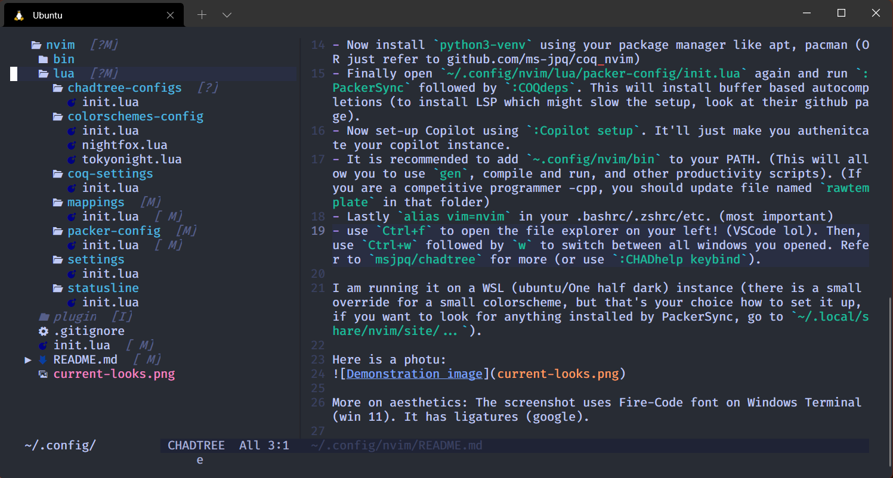

Presenting my dotfiles for neovim. I made a few small scripts to reduce some time in CP. Not that I solve all ABCDEF in div1 but while using VSCode (another pog editor) the language services, completions, and a whole new electron window seems tooooooo bloaty. So, I decided to write my own bloat (jk). This configuration is stripped off from tree-sitters so do not expect to use it like an IDE out of the box. You might edit it for yourself.

# How to use?
- Get neovim from your package manager/obtain binary
- Place this whole repo in `~/.config/nvim/` folder. (So the paths would read like `~/.config/nvim/lua/...`.)
- follow https://github.com/wbthomason/packer.nvim#quickstart to install Packer (a package manager for neovim plugins)
- Open `~/.config/nvim/lua/packer-config/init.lua` using `nvim`. Run `:luafile %` in NORMAL mode. Now type `:PackerSync`. Wait for some time. After it's finished exit nvim.
- Now install `python3-venv` using your package manager like apt, pacman (OR just refer to github.com/ms-jpq/coq_nvim)
- Finally open `~/.config/nvim/lua/packer-config/init.lua` again and run `:PackerSync` followed by `:COQdeps`. This will install buffer based autocompletions (to install LSP which might slow the setup, look at their github page).
- Now set-up Copilot using `:Copilot setup`. It'll just make you authenitcate your copilot instance.
- Lastly `alias vim=nvim` in your .bashrc/.zshrc/etc. (most important)

I am running it on a WSL (ubuntu/One half dark) instance (there is a small override for a small colorscheme, but that's your choice how to set it up, if you want to look for anything installed by PackerSync, go to `~/.local/share/nvim/site/...`).

Here is a photu:

More on aesthetics: The screenshot uses Fire-Code font on Windows Terminal (win 11). It has ligatures (google).  

