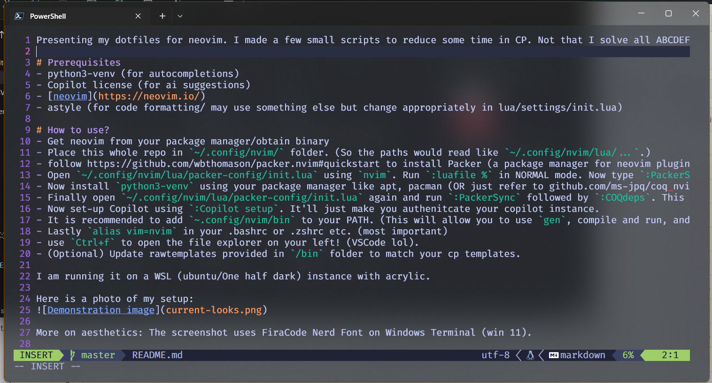

Presenting my dotfiles for neovim. I made a few small scripts to reduce some time in CP. Not that I solve all ABCDEF in div1 but while using VSCode (another pog editor) the language services, completions, and a whole new electron window seems tooooooo bloaty. So, I decided to write my own bloat (jk). This configuration is becoming IDE like everyday. You might edit it for yourself anyways.

# Prerequisites
- python3-venv (for autocompletions)
- Copilot license (for ai suggestions)
- [neovim](https://neovim.io/)
- astyle (for code formatting/ may use something else but change appropriately in lua/settings/init.lua)

# How to use?
- Get neovim from your package manager/obtain binary
- Place this whole repo in `~/.config/nvim/` folder. (So the paths would read like `~/.config/nvim/lua/...`.)
- follow https://github.com/wbthomason/packer.nvim#quickstart to install Packer (a package manager for neovim plugins)
- Open `~/.config/nvim/lua/packer-config/init.lua` using `nvim`. Run `:luafile %` in NORMAL mode. Now type `:PackerSync`. Wait for some time. After it's finished exit nvim.
- Now install `python3-venv` using your package manager like apt, pacman (OR just refer to github.com/ms-jpq/coq_nvim)
- Finally open `~/.config/nvim/lua/packer-config/init.lua` again and run `:PackerSync` followed by `:COQdeps`. This will install buffer based autocompletions (to install LSP which might slow the setup, look at their github page).
- Now set-up Copilot using `:Copilot setup`. It'll just make you authenitcate your copilot instance.
- It is recommended to add `~.config/nvim/bin` to your PATH. (This will allow you to use `gen`, compile and run, and other productivity scripts). (If you are a competitive programmer -cpp, you should update file named `rawtemplate` in that folder)
- Lastly `alias vim=nvim` in your .bashrc or .zshrc etc. (most important)
- use `Ctrl+f` to open the file explorer on your left! (VSCode lol). 
- (Optional) Update rawtemplates provided in `/bin` folder to match your cp templates.

I am running it on a WSL (ubuntu/One half dark) instance with acrylic.

Here is a photo of my setup:

More on aesthetics: The screenshot uses FiraCode Nerd Font on Windows Terminal (win 11).  

# VIM supremacy!

